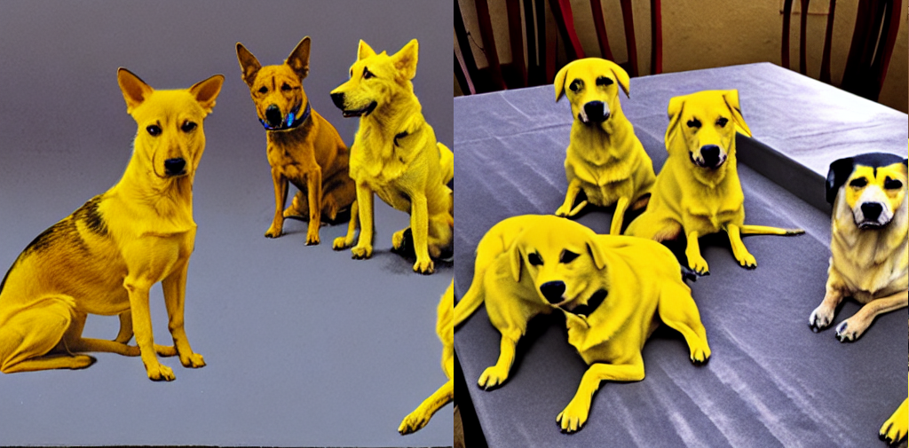
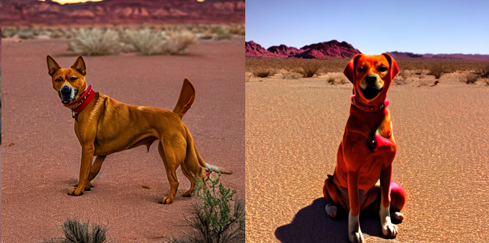
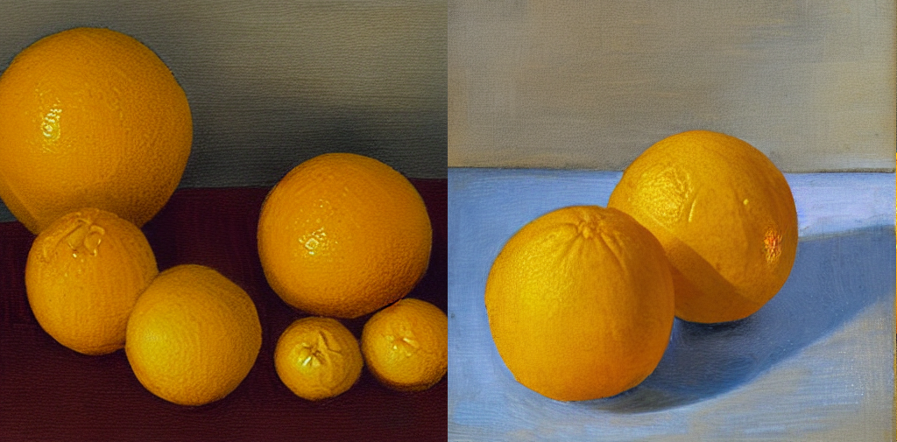

# T2I-HumanFeedback
Implementations of Baseline Methods for Aligning Text2Img Diffusion Models with Human Feedback.

- [Aligning text-to-image models using human feedback](https://arxiv.org/abs/2302.12192). Google Research.
- [Better Aligning Text-to-Image Models with Human Preference](https://arxiv.org/abs/2303.14420). MMLab@CUHK.

> This repo is still under reconstruction. 
>
> And I am working on incorporating Reinforcement Learning into t2i human feedback training.

## Setup

```shell
pip install git+https://github.com/huggingface/diffusers.git
```

## Training

```shell
cd demo
```

#### Step1: Generate prompts

```shell
python gen_prompt.py
```

#### Step2: Generate images

```shell
python gen_data.py
```

#### Step3: Label images manually

This implementation is a simplified version based on only matplotlib. 

Type "0"+"Enter" or "Enter" to label unsatisfying images.

Type "1"+"Enter" or [Random Character] to label the prompt-consistent images.

```shell
python manual_label.py
```

#### Step4: Train reward model (with pytorch_lightning)

```shell
python train_reward.py
```

#### Step5: Label other images automatically with reward model

```shell
python auto_label.py
```

#### Step6: Finetune your stable diffusion model with lora

```shell
accelerate launch train_text2img_lora.py
```

#### Evaluation

use tensorboard to check the ouput images

```shell
tensorboard --logdir=.
```


## TODO

- [x] Demo release for aligning text-to-image models using human feedback.

> Note: This demo is not sufficient for large-scale training.

- [ ] Faster image generation and labeling.
- [ ] Joint training with filtered [LAION](https://laion.ai/) and [Human preference dataset](https://mycuhk-my.sharepoint.com/personal/1155172150_link_cuhk_edu_hk/_layouts/15/onedrive.aspx?id=%2Fpersonal%2F1155172150_link_cuhk_edu_hk%2FDocuments%2FHPS%2Fdataset.zip&parent=%2Fpersonal%2F1155172150_link_cuhk_edu_hk%2FDocuments%2FHPS&ga=1).
- [ ] Incorporating Reinforcement Learning into text2img human feedback training.
- [ ] Open Reward Model: [ImageReward](https://github.com/THUDM/ImageReward).

## Results

Left: output of original Stable Diffusion Model.

Right: output of Aligned Stable Diffusion Model. 

---

`Prompt`: Four yellow dogs on the table.

<div align="center">

</div>

`prompt`: One red dog in the dessert

<div align="center">

</div>

`prompt`: Two yellow colored oranges.

<div align="center">

</div>

## Citations

```bibtex
@article{lee2023aligning,
  title={Aligning text-to-image models using human feedback},
  author={Lee, Kimin and Liu, Hao and Ryu, Moonkyung and Watkins, Olivia and Du, Yuqing and Boutilier, Craig and Abbeel, Pieter and Ghavamzadeh, Mohammad and Gu, Shixiang Shane},
  journal={arXiv preprint arXiv:2302.12192},
  year={2023}
}
```

```bibtex
@article{wu2023better,
  title={Better Aligning Text-to-Image Models with Human Preference},
  author={Wu, Xiaoshi and Sun, Keqiang and Zhu, Feng and Zhao, Rui and Li, Hongsheng},
  journal={arXiv preprint arXiv:2303.14420},
  year={2023}
}
```

## Shoutouts
This code builds on diffusers. Thanks for open-sourcing!
## Contact
If you have any questions or better implementation ways, feel free to open an issue or contact me through e-mail (wangfuyun@smail.nju.edu.cn)

